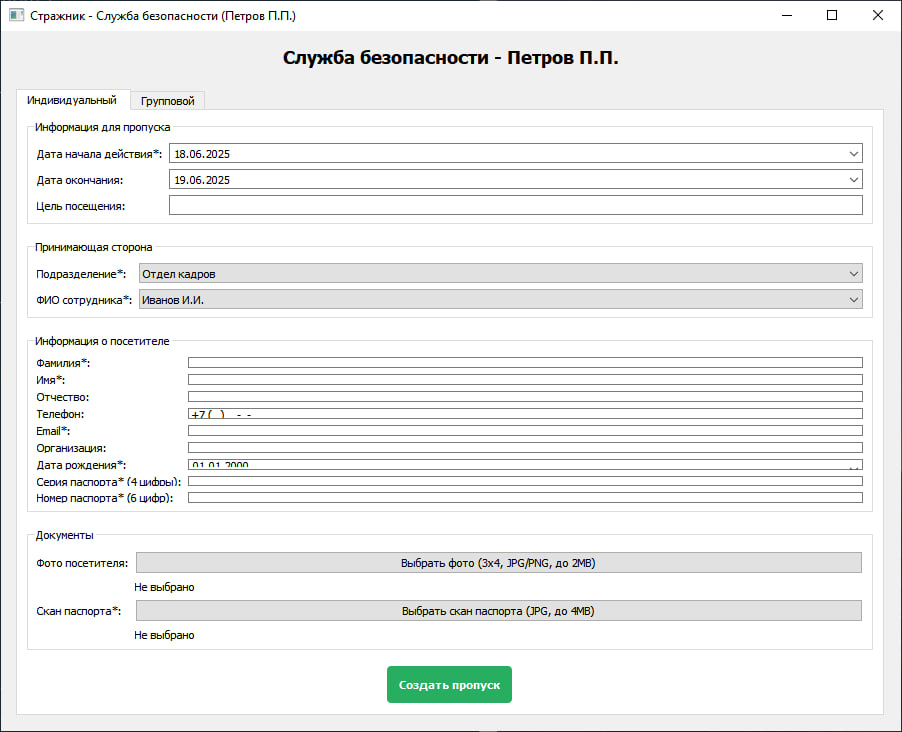

# 🧪 Тестовая документация системы "Стражник"

## 📌 Объект тестирования
Система контроля доступа с функционалом:
- Авторизация пользователей
- Создание индивидуальных пропусков
- Управление данными посетителей

## 🌡️ Текущий статус тестирования
**Активная фаза тестирования**  
Основной функционал готов к тестированию, критические сценарии требуют проверки.

---

## 🔍 Тест-кейсы

### 1. Авторизация
**Предусловие**: Наличие тестовых учетных записей

| ID | Действие | Ожидаемый результат | Статус |
|----|----------|---------------------|--------|
| A1 | Ввод корректных данных администратора | Успешный вход в систему | ✅ |
| A2 | Ввод корректных данных службы безопасности | Успешный вход | ✅ |
| A3 | Неверный пароль | Сообщение об ошибке | ✅ |
| A4 | Пустые поля | Предупреждение о заполнении | ✅ |

### 2. Создание пропуска
**Предусловие**: Успешная авторизация как "Служба безопасности"

| ID | Действие | Ожидаемый результат | Статус |
|----|----------|---------------------|--------|
| P1 | Заполнение всех обязательных полей | Пропуск создается | ✅ |
| P2 | Отсутствие скана паспорта | Ошибка валидации | ✅ |
| P3 | Дата начала раньше завтрашнего дня | Ошибка валидации | ✅ |
| P4 | Загрузка фото >2MB | Ошибка размера файла | ✅ |

---

## 🐛 Известные дефекты
1. **ID**: D-001  
   **Описание**: При повторной загрузке фото не очищается предыдущий файл  
   **Серьезность**: Средняя  
   **Статус**: В работе

2. **ID**: D-002  
   **Описание**: Нет валидации дублирующихся пропусков  
   **Серьезность**: Высокая  
   **Статус**: Открыт

---

## 🛠 Тестовая среда
- **ОС**: Windows 10/11, Ubuntu 20.04+
- **Python**: 3.7+
- **Браузер**: Не требуется (десктопное приложение)
- **Доп. ПО**: PyQt5
